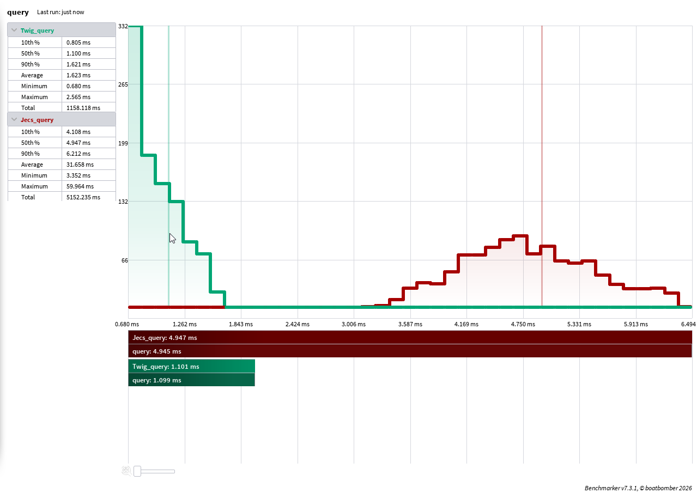

### Twig

The Wicked ecs Inspired by Git<br/>
ECS focused on being lightweight and having fast query speed.

- Fast uncached component queries
- Type-safe Luau API
- Low memory overhead
- Batching changes
- Explicit state publication

### Benchmark

Twig's compact archetype representation allows unmatched entities to be rejected cheaply, making highly selective queries particularly fast. 
you can find the benchmark [here](https://github.com/Meowtsun/Twig/blob/main/test/query.bench.luau)



### Overview

```lua
local Twig = require(path_to_twig)
local world = Twig.world()

local active = Twig.component() :: Twig.component<boolean>
local name = Twig.component() :: Twig.component<string>
local disabled = Twig.component()

-- this initial component is optional
local entity = world:spawn({
    active.set(true),
    name.set("Dummy"),
})


-- query entities with name and active, but without disabled.
for entity, name, active in world:query(name, active, disabled.none) do
    -- ...
end

-- Or check membership directly.
if world:withoutComponent(entity, disabled) then
    -- ...
end


-- Twig requires you to explicitly stage which component of which entity
-- was changed if you want to observe the change through Twig's signals.
-- You can stage a component even without changing its value.
-- Or, you can simply not stage() at all if you don't need to publish it.
world:stage(entity, {
    name,
    active,
})

-- publishIn will run after you flush everything with world:push()
local connection = name:publishedIn(world):Connect(function(entity, value)
    connection:Disconnect()
end)

-- These two do not require a push(); they fire immediately
-- name:createdIn(world) 
-- name:removedIn(world) 

-- Effects use the same system as components,
-- but cannot be added to an entity.
-- They are only staged.
local recompute_state = Twig.effect()
local same_signal_api = recompute_state:publishedIn(world)

-- Membership does not matter, entity does not need to have this component.
-- This acts like a built-in push signal using the same API.
world:stage(entity, {
    recompute_state,
})

-- flush all staged components of this world
world:push()
```

### Installation

Install Twig through Wally:

```toml
twig = "meowtsun/twig@0.1.1"
```
